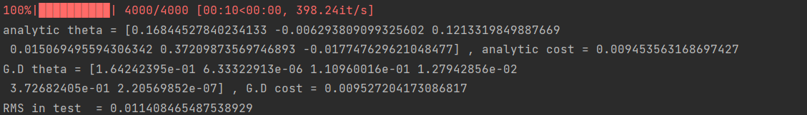

# 📉 Linear-regression-with-numpy

A comprehensive implementation of **Multiple Linear Regression** using **NumPy** to predict medical insurance charges. This project compares two fundamental optimization approaches: the **Analytic Solution (Normal Equation)** and **Gradient Descent**.

---

## 🎯 Study Goals
- **Optimization Comparison**: Contrast the performance and accuracy of the **Normal Equation** ($X^T X)^{-1} X^T y$ versus iterative **Gradient Descent**.
- **Feature Engineering**: Manually implement categorical encoding (Binary Encoding for sex, smoker, and region) and **Min-Max Normalization**.
- **Numerical Stability**: Observe how learning rates and numerical perturbations affect the convergence of the model.

---

## 🔬 Implementation Details

### 1. Data Preprocessing
- **Categorical Encoding**: Manually transforms string labels (`female/male`, `yes/no`) into binary numerical values ($0$ or $1$).
- **Normalization**: Scales features like `age`, `bmi`, and `children` to a $[0, 1]$ range to prevent feature dominance and speed up convergence.

### 2. Dual Optimization Strategy
- **Analytic Solution**: Computes the optimal weights ($\theta$) in a single step using the **Moore-Penrose Inverse** (Normal Equation).
- **Gradient Descent**: 
  - Updates $\theta$ iteratively over **4,000 epochs**.
  - Uses a **numerical gradient** approach (perturbing $\theta$ by a small $\Delta$) to approximate the slope of the cost function.
  - Implements a MSE (Mean Squared Error) cost function to evaluate performance.


### 3. Evaluation
- **Testing**: Validates the trained model on a separate test set (last 138 rows).
- **Metric**: Calculates the **Root Mean Square (RMS)** error to quantify prediction accuracy on unseen data.

---

## 🛠 Tech Stack
- **Language**: Python 3.x
- **Computation**: NumPy (Matrix multiplication, Inversion)
- **Data Handling**: Pandas
- **Progress Tracking**: Tqdm
- **Dataset**: Kaggle - [Medical Cost Personal Datasets](https://www.kaggle.com/datasets/mirichoi0218/insurance)

---

## 📂 Project Structure
- `main.py`: Core script containing preprocessing, analytic solver, and gradient descent logic.

---

## 📊 Results
The model provides a direct comparison between the two methods:
```text
analytic cost = 0.010...
G.D cost = 0.012...
RMS in test = 0.009...
```


## Data 
* https://www.kaggle.com/code/sudhirnl7/linear-regression-tutorial/data
* train data number = 1200 
*  test data number = 300 
## Normalize 
* Min - Max 

## Comment

* You can check that one feature( specfically, last feature in parameter vector) can not be trained well compared with other features from the image. This is the reason why we have to use "Adaptative" optimizer such as Adam 
## Image 

